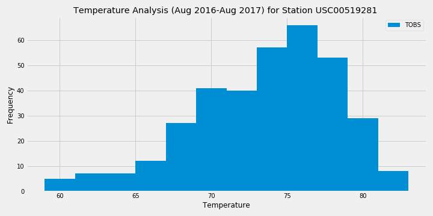

# SQLAlchemy Challenge - Surfs Up!


Planning a vacation to Honolulu, Hawaii! By Python and SQLAlchemy, I will be doing basic climate analysis and data exploration from climate database to plan this vacation. 

The following outlines are the steps I will be taking to complete this analysis: 

## Step 1 - Climate Analysis and Exploration

To begin, use Python and SQLAlchemy to do basic climate analysis and data exploration of your climate database. All of the following analysis should be completed using SQLAlchemy ORM queries, Pandas, and Matplotlib.

* ###### Creating The Engine to connect to "hawaii.sqlite" database

  ```
  engine = create_engine("sqlite:///Resources/hawaii.sqlite")
  ```

  ###### Create automap_base() to reflect your tables into classes

  - Reflect Tables into SQLAlchemy ORM

  ```
  # reflect an existing database into a new model
  Base = automap_base()
  
  # reflect the tables
  Base.prepare(engine, reflect=True)
  
  # We can view all of the classes that automap found
  Base.classes.keys()
  ```

  ```
  ['measurement', 'station']
  ```

### Precipitation Analysis

* Design a query to retrieve the last 12 months of precipitation data.

* Select only the `date` and `prcp` values.

  ```
  lastyear_prcp_date = session.query(Measurement.date, Measurement.prcp).\
                            filter( Measurement.date >= year_ago ).\
                            order_by(Measurement.date.desc()).all()
  lastyear_prcp_date[:5]
  ```

* Load the query results into a Pandas DataFrame and set the index to the date column.

* Sort the DataFrame values by `date`.

  ```
  df = pd.DataFrame(lastyear_prcp_date, columns=["Date", "Precipitation"])
  df.set_index('Date', inplace=True) 
  df.sort_values('Date', inplace=True) 
  df.head()
  ```

  |            | Precipitation |
  | :--------- | :------------ |
  | Date       |               |
  | 2016-08-23 | 0.70          |
  | 2016-08-23 | 0.00          |
  | 2016-08-23 | 0.15          |
  | 2016-08-23 | 1.79          |
  | 2016-08-23 | NaN           |

* Plot the results using the DataFrame `plot` method.

  

  

* Use Pandas to print the summary statistics for the precipitation data.

  ```
  df.describe()
  ```

  |       | Precipitation |
  | :---- | :------------ |
  | count | 2021.000000   |
  | mean  | 0.177279      |
  | std   | 0.461190      |
  | min   | 0.000000      |
  | 25%   | 0.000000      |
  | 50%   | 0.020000      |
  | 75%   | 0.130000      |
  | max   | 6.700000      |

### Station Analysis

* Design a query to calculate the total number of stations.

```
stations = session.query(Measurement).group_by(Measurement.station).count()
print (f'Total Number of Stations:  {stations}
```

* Design a query to find the most active stations.

  * List the stations and observation counts in descending order.

    ```
    most_active= session.query(Measurement.station, 		  
    					       func.count(Measurement.station)).\
                               group_by(Measurement.station).\
                               order_by(func.count(Measurement.station).desc()).all()
    
    most_active
    ```

    [('USC00519281', 2772), ('USC00519397', 2724), ('USC00513117', 2709), ('USC00519523', 2669), ('USC00516128', 2612), ('USC00514830', 2202), ('USC00511918', 1979), ('USC00517948', 1372), ('USC00518838', 511)]

    

  * Which station has the highest number of observations?

    **Station USC00519281 has the highest number of observation: 2772 weather observations**

  ```
  most_active_one = session.query(Measurement.station, func.count(Measurement.station)).\
                    group_by(Measurement.station).\
                    order_by(func.count(Measurement.station).desc()).first()
  
  print (f'Station {most_active_one[0]} has the highest number of observation: {most_active_one[1]} weather obeservations')
  ```

  

* Design a query to retrieve the last 12 months of temperature observation data (TOBS).

  ```
highest_temp = session.query(Measurement.date,(Measurement.tobs)).\
                            filter(Measurement.date >= year_ago ).\
                          filter(Measurement.station == "USC00519281").group_by(Measurement.date).all()
  ```
  
  
  
  |      | Date       | TOBS |
  | :--- | :--------- | :--- |
  | 345  | 2017-08-06 | 83.0 |
  | 344  | 2017-08-05 | 82.0 |
  | 340  | 2017-07-29 | 82.0 |
  | 334  | 2017-07-23 | 82.0 |
  | 313  | 2017-07-02 | 81.0 |
  
  
  
  * Plot the results as a histogram with `bins=12`.
  
    

- - -

## Step 2 - Climate App

Now that you have completed your initial analysis, design a Flask API based on the queries that you have just developed.

* Use Flask to create your routes.

### Routes

* `/`

  * Home page.

  * List all routes that are available.

* `/api/v1.0/precipitation`

  * Convert the query results to a dictionary using `date` as the key and `prcp` as the value.

  * Return the JSON representation of your dictionary.

* `/api/v1.0/stations`

  * Return a JSON list of stations from the dataset.

* `/api/v1.0/tobs`
  * Query the dates and temperature observations of the most active station for the last year of data.
  
  * Return a JSON list of temperature observations (TOBS) for the previous year.

* `/api/v1.0/<start>` and `/api/v1.0/<start>/<end>`

  * Return a JSON list of the minimum temperature, the average temperature, and the max temperature for a given start or start-end range.

  * When given the start only, calculate `TMIN`, `TAVG`, and `TMAX` for all dates greater than and equal to the start date.

  * When given the start and the end date, calculate the `TMIN`, `TAVG`, and `TMAX` for dates between the start and end date inclusive.

## Hints

* You will need to join the station and measurement tables for some of the queries.

* Use Flask `jsonify` to convert your API data into a valid JSON response object.

- - -

## Bonus: Analyse

### Temperature Analysis I

* Hawaii is reputed to enjoy mild weather all year. Is there a meaningful difference between the temperature in, for example, June and December?

* You may either use SQLAlchemy or pandas's `read_csv()` to perform this portion.

* Identify the average temperature in June at all stations across all available years in the dataset. Do the same for December temperature.

* Use the t-test to determine whether the difference in the means, if any, is statistically significant. Will you use a paired t-test, or an unpaired t-test? Why?

### Temperature Analysis II

* The starter notebook contains a function called `calc_temps` that will accept a start date and end date in the format `%Y-%m-%d`. The function will return the minimum, average, and maximum temperatures for that range of dates.

* Use the `calc_temps` function to calculate the min, avg, and max temperatures for your trip using the matching dates from the previous year (i.e., use "2017-01-01" if your trip start date was "2018-01-01").

* Plot the min, avg, and max temperature from your previous query as a bar chart.

  * Use the average temperature as the bar height.

  * Use the peak-to-peak (TMAX-TMIN) value as the y error bar (YERR).

    

### Daily Rainfall Average

* Calculate the rainfall per weather station using the previous year's matching dates.

* Calculate the daily normals. Normals are the averages for the min, avg, and max temperatures.

* You are provided with a function called `daily_normals` that will calculate the daily normals for a specific date. This date string will be in the format `%m-%d`. Be sure to use all historic TOBS that match that date string.

* Create a list of dates for your trip in the format `%m-%d`. Use the `daily_normals` function to calculate the normals for each date string and append the results to a list.

* Load the list of daily normals into a Pandas DataFrame and set the index equal to the date.

* Use Pandas to plot an area plot (`stacked=False`) for the daily normals.

  

### Copyright

Trilogy Education Services © 2020. All Rights Reserved.
