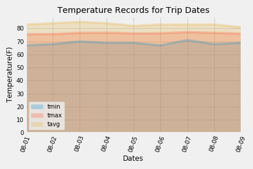

# [SQLAlchemy - Surfs Up!](https://github.com/fereshtehaghaei/Climate-Analysis-SQLAlchemy/)

## Background: 

Planning a vacation to Honolulu, Hawaii! By Python and SQLAlchemy, I will be doing basic climate analysis and data exploration from climate database to plan this vacation. 

## Objective: 

- Used Python and SQLAlchemy ORM queries with provided hawaii.sqlite to reflect tables into a new model and perform analysis of Hawaii climate.

- Built a Flask Web app using the served queries that will return JSONified query results from API endpoints.

  

  ##### This challenge was done in 2 steps:

- Climate Analysis using SQLAlchemy and Python

- Design a Flask API Web Climate App

  

## Step 1 - Climate Analysis and Exploration

Used Python and SQLAlchemy to do basic climate analysis and data exploration of your climate database. 

All of the following analysis were completed using SQLAlchemy ORM queries, Pandas, and Matplotlib.

- Used SQLAlchemy `create_engine` to connect to "hawaii.sqlite" database

* Used SQLAlchemy `automap_base()` to reflect your tables into classes and save a reference to those classes called `Station` and `Measurement`.

* Reflected Tables into SQLAlchemy ORM

  

### Precipitation Analysis

* Designed a query to retrieve the last 12 months of precipitation data.

* Selected only the `date` and `prcp` values.

* Loaded the query results into a Pandas DataFrame and set the index to the date column.

* Sorted the DataFrame values by `date`.

* Plotted the results using the DataFrame `plot` method.

  

  

  ### Station Analysis

  - Designed a query to calculate the total number of stations.
  - Designed a query to find the most active stations.
  - Listed the stations and observation counts in descending order.
  - Found out which station has the highest number of observations.
  - Designed a query to retrieve the last 12 months of temperature observation data (tobs).

### Temperature Analysis

* Defined a function called  `calc_temps` to calculate the min, avg, and max temperatures for your trip using the matching dates from the previous year (i.e., use "2017-01-01" if your trip start date was "2018-01-01").

* Plotted the min, avg, and max temperature from your previous query as a bar chart.

  * Used the average temperature as the bar height.

  * Used the peak-to-peak (TMAX-TMIN) value as the y error bar (YERR).

    

### Daily Rainfall Average

* Calculated the rainfall per weather station using the previous year's matching dates.

* Calculated the daily normals. Normals are the averages for the min, avg, and max temperatures.

* Defined a function called `daily_normals` that will calculate the daily normals for a specific date. This date string will be in the format `%m-%d`.

* Created a list of dates for your trip in the format `%m-%d`. Used the `daily_normals` function to calculate the normals for each date string and append the results to a list.

* Loaded the list of daily normals into a Pandas DataFrame and set the index equal to the date.

* Used Pandas to plot an area plot (`stacked=False`) for the daily normals.

  

## Step 2 - Climate App

##### Used Flask to create API routes for Hawaii Weather.

##### Designed Flask app can be viewed here: [Hawaii Climate App](https://github.com/fereshtehaghaei/Climate-Analysis-SQLAlchemy/blob/master/my_app.py)

------

Below Steps have been done/executed in Hawaii Climate App

### Routes

* `/`
  * Home page.

* `/api/v1.0/precipitation`

  * Convert the query results to a dictionary using `date` as the key and `prcp` as the value.

  * Return the JSON representation of your dictionary.

* `/api/v1.0/stations`

  * Return a JSON list of stations from the dataset.

* `/api/v1.0/tobs`
  * Query the dates and temperature observations of the most active station for the last year of data.

  * Return a JSON list of temperature observations (TOBS) for the previous year.

* `/api/v1.0/<start>` and `/api/v1.0/<start>/<end>`

  * Return a JSON list of the minimum temperature, the average temperature, and the max temperature for a given start or start-end range.

  * When given the start only, calculate `TMIN`, `TAVG`, and `TMAX` for all dates greater than and equal to the start date.

  * When given the start and the end date, calculate the `TMIN`, `TAVG`, and `TMAX` for dates between the start and end date inclusive.

- - -

### Copyright

Fereshteh Aghaei © 2021. All Rights Reserved.